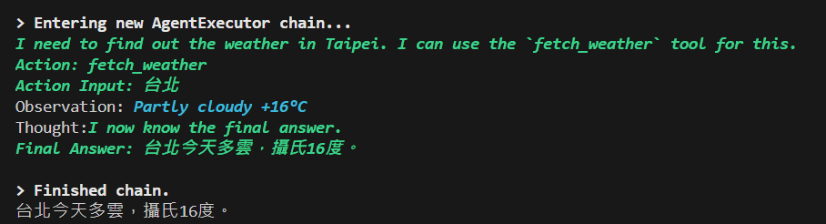

# LLM LangChain Weather Agent

使用 LangChain 整合 Ollama 模型（我使用的是 Gemma3），實現 AI 代理的功能調用，讓模型決定是否調用外部 API 以獲取天氣數據來作為回應。  

## Overview

- 語言: Python v3.12
- 模組: langchain v0.3.20, langchain-core v0.3.41, langchain-ollama v0.2.3


## Env

```
OLLAMA_URL='localhost:11434'
OLLAMA_MODEL='gemma3:27b'
```

## Run

### Install Module

```bash
pip install langchain==0.3.20 langchain-core==0.3.41 langchain-ollama==0.2.3 python-dotenv==1.0.1
```

### Run
```bash
python agent.py
```


## Demo
